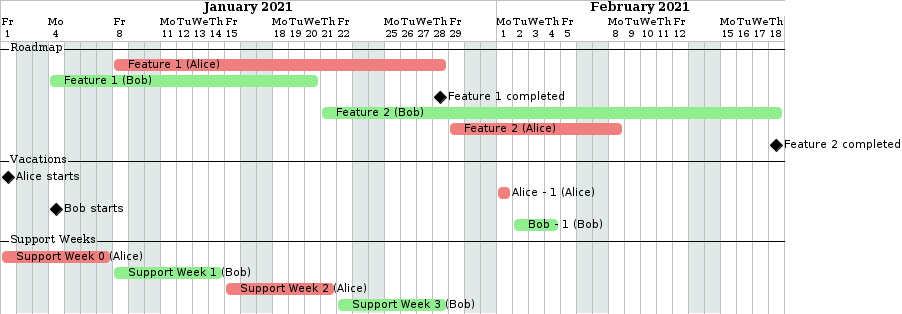

# planner

Planner helps development teams prioritize their works and communicate realistic task completion forecasts.

# workflow

- Install planner
```shell script
go get github.com/ostapneko/planner/planner
```
- Create a planning file. See the dedicated section for the specs.
- Run planner to generate completion dates and optionally a Gantt chart.
```shell script
planner -o output-planning.yaml -g gantt input-planning.yaml
```
- Run [PlantUML](https://plantuml.com/) to generate a visual output:
```shell script
java -jar plantuml.jar gantt
```
Example output



# Planing file specs

It is written in the YAML format. All dates are expressed in the `dd/MM/yyyy` format.

The weekend days (Saturdays and Sundays) are closed.

```yaml
# The start of the planning. Basically, man-days will be allocated
# to tasks from this date on
startDay: 01/01/2021
# List of holidays that apply to every developers
holidays:
  - 05/01/2021
developers:
  - id: Alice
    # Days that are not worked by this developer
    offDays:
      - 01/02/2021
    # First work day, when a developer joins the team or the company
    starts: 01/01/2021
  - id: Bob
    # Part of the time Bob is assigned to feature work
    utilization: 0.4
    starts: 04/01/2021
    # Last work day, when a developer leaves the team or the company
    ends: 01/03/2021
# This is pretty specific to some organization, whereby, at all time, a developer is pulled from feature work in order to work exclusively on support duties.
supportWeeks:
  - firstDay: 01/01/2021
    lastDay: 07/01/2021
    devId: Alice
# In addition to the name and attributions fields, each attribution has a write-only field: lastDay. This fields is computed by planner, and overwritten if filled.
tasks:
  - name: Feature 1
    # In addition to the effort field, each attribution has two write-only fields, firstDay and lastDay. These fields are computed by planner, and overwritten if filled.
    attributions:
      Alice:
        # This is the effort, expressed in work days
        effort: 10
      Bob:
        effort: 5
```

# Quick rationale

Planner supports a very narrow set of use cases (basically only mine at the moment), and this is the polar opposite of a general purpose project management tool. More precisely, it follows the following usage principles:
- The edition is purely text-based. For me, it's quicker to edit, easier to automate and version.
- Support some kind of visual output, namely in the form of Gantt chart. While I dislike editing anything other than text, I also think that it's often a poor medium to summarize and communicate ideas.
- Support the same format for its input and its output, as explained in the workflow section.
- Doesn't support multiple conflicting constraints on the same item. For example, you can only specify the effort needed to complete each task, not the desired completion dates. It's limiting, but more simple and enough for my personal needs.
